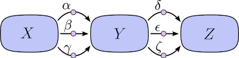
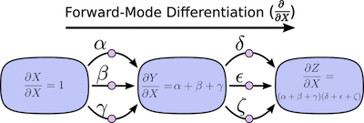
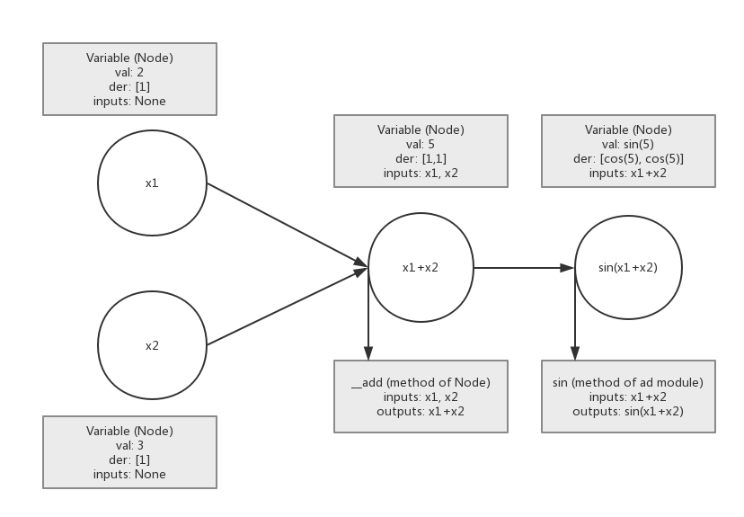

# AutoDiff Documentation (Milestone 1)

### Nick Stern, Vincent Viego, Summer Yuan, Zach Wehrwein

## Introduction
Calculus, according to the American mathematician Michael Spivak in his noted textbook, is fundamentally the study of "infinitesimal change." An infinitesimal change, according to Johann Bernoulli as Spivak quotes, is so tiny that "if a quantity is increased or decreased by an infinitesimal, then that quantity is neither increased nor decreased." The study of these infinitesimal changes is the study of relationships of change, not the computation of change itself. The derivative is canonically found as function of a limit of a point as it approaches 0 -- we care about knowing the relationship of change, not the computation of change itself.

One incredibly important application of the derivative is varieties of optimization problems. Machines are able to traverse gradients iteratively through calculations of derivatives. However, in machine learning applications, it is possible to have millions of parameters for a given neural net and this would imply a combinatorially onerous number of derivatives to compute analytically. A numerical Newton's method approach (iteratively calculating through guesses of a limit) is likewise not a wise alternative because even for "very small"
, the end result can be orders of magnitude off in error relative to machine precision.

So, one might think that a career in ML thus requires an extensive calculus background, but, Ryan P Adams, formerly of Twitter (and Harvard IACS), now of Princeton CS, describes automatic differentiation as ["getting rid of the math that gets in the way of solving a [ML] problem."](https://www.youtube.com/watch?v=sq2gPzlrM0g) What we ultimately care about is tuning the hyperparameters of a machine learning algorithm, so if we can get a machine to do this for us, that is ultimately what we care about. What is implemented in this package is automatic differentiation which allows us to calculate derivatives of complex functions to machine precision 'without the math getting in the way.'

## Background
The most important calculus derivative rule for automatic differentiation is the multivariate chain rule.

The basic chain rule states that the derivative of a composition of functions is:


That is, the derivative is a function of the incremental change in the outer function applied to the inner function, multiplied by the change in the inner function.

In the multivariate case, we can apply the chain rule as well as the rule of total differentiation. For instance, if we have a simple equation:


Then,


The partial derivatives:


The total variation of y depends on both the variations in u, v and thus,


What this trivial example illustrates is that the derivative of a multivariate function is ultimately the addition of the partial derivatives and computations of its component variables. If a machine can compute any given sub-function as well as the partial derivative between any sub-functions, then the machine need only add-up the product of a function and its derivatives to calculate the total derivative.

[An intuitive way of understanding automatic differentiation is to think of any complicated function as ultimately a a graph of composite functions.](http://colah.github.io/posts/2015-08-Backprop/) Each node is a primitive operation -- one in which the derivative is readily known -- and the edges on this graph -- the relationship of change between any two variables -- are partial derivatives. The sum of the paths between any two nodes is thus the partial derivative between those two functions (this a graph restatement of the total derivative via the chain rule).

Forward mode automatic differentiation thus begins at an input to a graph and sums the source paths. The below diagrams (from Christopher Olah's blog) provide an intuition for this process. The relationship between three variables (X, Y, Z) is defined by a number of paths (). Forward mode begins with a seed of 1, and then in each node derivative is the product of the sum of the previous steps.





Consequently, provided that within each node there is an elementary function, the machine can track the derivative through the computational graph.

There is one last piece of the puzzle: dual numbers which extend the reals by restating each real as , where . Symbolic evaluation, within a machine, can quickly become computational untenable because the machine must hold in memory variables and their derivatives in the successive expansions of the rules of calculus. Dual numbers allow us to track the derivative of even a complicated function, as a kind of data structure that caries both the derivative and the primal of a number.

In our chain rule equation, there are two pieces to the computation: the derivative of the outer function applied to the inner function and that value multiplied by the derivative of the inner function. This means that the full symbolic representation of an incredibly complicated function can grow to exponentially many terms. However, dual numbers allow us to parse that symbolic representation in bitesized pieces that can be analytically computed. [The reason for this is the Taylor series expansion of a function](http://jliszka.github.io/2013/10/24/exact-numeric-nth-derivatives.html):


When one evaluates , given that , then all the higher order terms drop out (they are 0) and one is left with 


To recap: automatic differentiation is an algorithmic means of computing complicated derivatives by parsing those functions as a graph structures to be traversed. Dual numbers are used as a sort of mathematical data structure which allows the machine to analytically compute the derivative at any given node. It is superior to analytic or symbolic differentiation because it is actually computationally feasible on modern machines! And it is superior to numerical methods because automatic differentiation is far more accurate (it achieves machine precision).

## How to Use AutoDiff
In order to instantiate an auto-differentiation object from our package, the user shall first import the AutoDiff library:

```py
Import AutoDiff as ad
```

The general workflow for the user is as follows:
- Instantiate all variables as AutoDiff “Variable” objects.
- Input these variables into elementary functions from the AutoDiff library to create more complex expressions that propagate the derivative.

The “Variable” class is the core constructor for all variables in the function that are to be differentiated.  The general schematic for how the user shall instantiate and interact with this class is outlined below:

1. Create an “Variable” object out of each variable in the function to be differentiated,  passing in the value of the variable as follows:

```python
x = ad.Variable(value = 1)
```

- To instantiate multiple “Variable” objects at once, the user may pass in a list of values:

```python
var_list = ad.Variable(value = [1, 2, 3])
```

2. Next, the user shall pass in these variables into elementary functions as follows:
```python
result = ad.sin(x)
results = ad.sin(var_list)
```

Simple operators, such as sums and products, can be used normally:
```python
result = 6*x
results = var_list + 4
```

```python
x, y, z = ad.Variable(value = [2, 3, 4])
result = ad.sin(x) + 6*y + x*y*z
```

3. Finally, (as a continuation of the previous example), the user may access the value and derivative of a function using the following attributes:

```python
result.val # The value of the function
result.der # The derivative of the function
```

## Software Organization

### Directory Structure

#### Overview
Our project will adhere to the directory structure outlined in the [python-packaging documentation](https://python-packaging.readthedocs.io/en/latest/index.html). At a high level (with exact names subject to change), the project will have the following structure:

```python
autodiff/
    autodiff/
        examples/
            __init__.py
            ...
        nodes/
            __init__.py
            node.py
            variable.py
            constant.py
            complex.py
            ...
        operators/
            __init__.py
            operator.py
            ...
        tests/
            __init__.py
            ...
        autodiff.py  # driver for centralizing operator and node usage
    LICENSE
    MANIFEST.in
    README.md
    setup.py
    .gitignore
```

#### examples/
The examples sub-directory will contain Python files with documented use cases of the library. Potential examples include an implementation of Newton’s Method for approximating the roots of a non-linear function and a module which computes local extrema, both of which use the AutoDiff driver defined in the top-level project directory ().

#### nodes/
The nodes sub-directory will contain the Node superclass and associated subclasses.
Other packages will not import and the use the Node class directly, instead
they will work directly with the children such as Variable and Complex.

#### operators/
The operators sub-directors will contain the Operator superclass and associated subclasses.

#### tests/
The tests sub-directory will contain the project’s testing suite and will be formatted according to the pytest requirements for automatic test discovery.

### External Dependencies

#### Overview
This project aims to restrict dependencies on third-party libraries to the necessary min- imum. Thus, the application will be restricted to using numpy as necessary for mathematical computation (e.g., trigonometric functions). The test suite will use pytest and pytest-cov to perform unit testing and coverage analysis of such testing.

### Testing

#### Overview
The majority of the testing in this project’s test suite will consist of unit testing. The aim is verifying the correctness of the application with thorough unit testing of all simple usages of the forward mode of automatic differentiation. Essentially, this will involve validating that our application produces correct calculations for all elementary functions. Additionally, a range of more complex unit testing will cover advanced scenarios such as functions with multidimensional domains and codomains as well as functions which created complexity via composition of elementary functions.

Additionally, the test suite will contain benchmarking and performance tests to demon- strate the scalability and limitations of the application.

#### Test Automation
In this project we will use continuous integration testing through Travis CI to perform automated, machine independent testing. Additionally, we will use Coveralls to validate the high code coverage of our testing suite.
We will embed the Travis CI and Coveralls badges into the project README to provide transparency for users interacting with our project through GitHub.

#### User Verification
We plan on including all tests in the project distribution, thus allowing users to verify correctness for themselves using pytest and pytest-cov locally after installing the project package.

### Distribution

#### Overview
Following the conventions defined in the [python-packaging documentation](https://python-packaging.readthedocs.io/en/latest/index.html), this project’s packaging structure has been designed in such a way as to allow users to perform installation through pip. Specifically, our package will be uploaded to PyPi using Twine.

#### Licensing
This project will be distributed under the GNU GPLv3 license to allow free “as is” usage while requiring all extensions to remain open source.


## Implementation
As for implementation of the forward mode of automatic differentiation, there are 5 steps to consider:

	1. The user generates the initial variables.
	2. The user generates the goal function.
	3. The user asks for value or derivative of the goal function.
	4. The goal function will call the overloaded operation methods to generate variables and get the values and the derivatives iteratively.
	5. The program returns the final result to the user's goal function.

To construct the computational graph, the core data structures should clearly represent all the nodes and edges included in the graph.
So, we have a superclass Node, which can describe all kinds of nodes included in the computational graph. For the superclass Node, there are 2 subclasses: Variable and Vectorvariable. Variable only deals with scalar functions of scalar values while Vectorvariable deals with scalar functions of vectors. If the user wants to further deal with vector functions of scalar values/vectors, they can just create a vector of scalar functions of scalar values/vectors.
For each Variable, we have value, derivative and inputs (previous Nodes) as its attributes. Previous Nodes are the Nodes who have edges pointing to the Node. 
For each Vectorvariable, we have value, jacobi matrix and inputs (previous Nodes) as its attributes.
```python
class Node():
	def __init__(self, value, derivative = 1):
		self.val = value
		self.der = [derivative]
		self.inputs = []

class Variable(Node):

class Vectorvariable(Node):
	def __init__(self, value, jacobi = False):
		self.val = value
		if not jacobi:
			self.jacobi = [np.eye(len(val))]
		else:
			self.jacobi = jacobi
		self.inputs = []
```

After the class node is created, the user can generate initial variables. They may do this by:

```python
x1 = ad.Variable(2)
x2 = ad.Variable(3)
```

Then the user wants to generate the goal function, which needs to load elementary functions such as $sin, exp$ and basic operators such as '+'. For the simple operators, we will overload them in the class Variable and Vectorvariable separately. For elementary functions, we will implement separate methods for each elementary function in the module, and we will define how they will process both Varaible inputs and Vectorvariable inputs.
For each method of operation (basic operations or elementary functions), it will return a new Node class which includes value, derivative/jacobi and previous Nodes. The attribute derivative/jacobi of Node is a list (it is more like a gradient), which will include partial differentials of all the initial variables the user wants to be differentiated in the goal function. 
And different opperation methods will have different restrictions. We will rely on numpy to get the calculation results of these operation methods.

Then the user can construct the goal function by calling the Node classes and the operation methods in our module. For example:

```python
y = ad.sin(x1+x2)
```




And the user will just do the following things to get value and gradients of the goal function:

```python
y_val = y.val 
dy/dx1 = y.der[0]
dy/dx2 = y.der[1]
```
