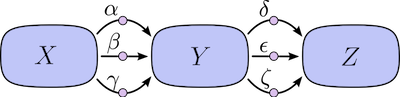
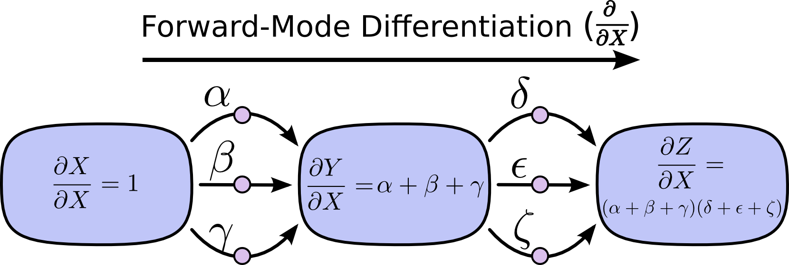

# AutoDiff Documentation (Milestone 1)

### Nick Stern, Vincent Viego, Summer Yuan, Zach Wehrwein

## Introduction
Calculus, according to the American mathematician Michael Spivak in his noted textbook, is fundamentally the study of "infinitesimal change." An infinitesimal change, according to Johann Bernoulli as Spivak quotes, is so tiny that "if a quantity is increased or decreased by an infinitesimal, then that quantity is neither increased nor decreased." The study of these infinitesimal changes is the study of relationships of change, not the computation of change itself. The derivative is canonically found as function of a limit of a point as it approaches 0 -- we care about knowing the relationship of change, not the computation of change itself.

One incredibly important application of the derivative is varieties of optimization problems. Machines are able to traverse gradients iteratively through calculations of derivatives. However, in machine learning applications, it is possible to have millions of parameters for a given neural net and this would imply a combinatorially onerous number of derivatives to compute analytically. A numerical Newton's method approach (iteratively calculating through guesses of a limit) is likewise not a wise alternative because even for "very small"
, the end result can be orders of magnitude off in error relative to machine precision.

So, one might think that a career in ML thus requires an extensive calculus background, but, Ryan P Adams, formerly of Twitter (and Harvard IACS), now of Princeton CS, describes automatic differentiation as ["getting rid of the math that gets in the way of solving a [ML] problem."](https://www.youtube.com/watch?v=sq2gPzlrM0g) What we ultimately care about is tuning the hyperparameters of a machine learning algorithm, so if we can get a machine to do this for us, that is ultimately what we care about. What is implemented in this package is automatic differentiation which allows us to calculate derivatives of complex functions to machine precision 'without the math getting in the way.'

## Background
The most important calculus derivative rule for automatic differentiation is the multivariate chain rule.

The basic chain rule states that the derivative of a composition of functions is:


That is, the derivative is a function of the incremental change in the outer function applied to the inner function, multiplied by the change in the inner function.

In the multivariate case, we can apply the chain rule as well as the rule of total differentiation. For instance, if we have a simple equation:


Then,


The partial derivatives:


The total variation of y depends on both the variations in u, v and thus,


What this trivial example illustrates is that the derivative of a multivariate function is ultimately the addition of the partial derivatives and computations of its component variables. If a machine can compute any given sub-function as well as the partial derivative between any sub-functions, then the machine need only add-up the product of a function and its derivatives to calculate the total derivative.

[An intuitive way of understanding automatic differentiation is to think of any complicated function as ultimately a a graph of composite functions.](http://colah.github.io/posts/2015-08-Backprop/) Each node is a primitive operation -- one in which the derivative is readily known -- and the edges on this graph -- the relationship of change between any two variables -- are partial derivatives. The sum of the paths between any two nodes is thus the partial derivative between those two functions (this a graph restatement of the total derivative via the chain rule).

Forward mode automatic differentiation thus begins at an input to a graph and sums the source paths. The below diagrams (from Christopher Olah's blog) provide an intuition for this process. The relationship between three variables (X, Y, Z) is defined by a number of paths (). Forward mode begins with a seed of 1, and then in each node derivative is the product of the sum of the previous steps.





Consequently, provided that within each node there is an elementary function, the machine can track the derivative through the computational graph.

There is one last piece of the puzzle: dual numbers which extend the reals by restating each real as , where . Symbolic evaluation, within a machine, can quickly become computational untenable because the machine must hold in memory variables and their derivatives in the successive expansions of the rules of calculus. Dual numbers allow us to track the derivative of even a complicated function, as a kind of data structure that caries both the derivative and the primal of a number.

In our chain rule equation, there are two pieces to the computation: the derivative of the outer function applied to the inner function and that value multiplied by the derivative of the inner function. This means that the full symbolic representation of an incredibly complicated function can grow to exponentially many terms. However, dual numbers allow us to parse that symbolic representation in bitesized pieces that can be analytically computed. [The reason for this is the Taylor series expansion of a function](http://jliszka.github.io/2013/10/24/exact-numeric-nth-derivatives.html):


When one evaluates , given that , then all the higher order terms drop out (they are 0) and one is left with 


To recap: automatic differentiation is an algorithmic means of computing complicated derivatives by parsing those functions as a graph structures to be traversed. Dual numbers are used as a sort of mathematical data structure which allows the machine to analytically compute the derivative at any given node. It is superior to analytic or symbolic differentiation because it is actually computationally feasible on modern machines! And it is superior to numerical methods because automatic differentiation is far more accurate (it achieves machine precision).

## How to Use AutoDiff
In order to instantiate an auto-differentiation object from our package, the user shall first import the AutoDiff Driver from the AutoDiff library (see implementation section for more detail):

```py
Import AutoDiff.AutoDiff as ad
```

The general workflow for the user is as follows:
- Instantiate all variables as AutoDiff objects.
- Input these variables into operators from the Operator class within the AutoDiff library to create more complex expressions that propagate the derivative.

The AutoDiff class is the core constructor for all variables in the function that are to be differentiated. There are two options for instantiating variables: Scalar and Vector, generated with create_scalar and create_vector respectively. Scalar variables have a single value per variable, while Vector variables can have multiple associated values. The general schematic for how the user shall instantiate AutoDiff objects is outlined below:

1. Create either a Scalar or Vector AutoDiff object to generate inputs to later pass into the function to be differentiated. The initialization works as follows:

```python
x, y = ad.create_scalar(num = 2, value = [1,2])
z = ad.create_vector(num = 3, value = [1,2,3])
```

2. Next, the user shall import the Operator class and pass in these variables into elementary functions as follows:
```python
from AutoDiff.Operators import Operator as op
result = op.sin(x*y)
results = op.sin(z)
```

Simple operators, such as sums and products, can be used normally:
```python
result = 6*x
results = z + 4
```

3. Finally, (as a continuation of the previous example), the user may access the value and derivative of a function using the .eval() method:

```python
print(result.eval())
```
For scalars, result.eval() will return a tuple of (value, derivative) and for vectors, result.eval() shall return a list of tuples (value1, partialderivative1).

## Software Organization

### Directory Structure

Our project will adhere to the directory structure outlined in the [python-packaging documentation](https://python-packaging.readthedocs.io/en/latest/index.html). At a high level (with exact names subject to change), the project will have the following structure:

```python
autodiff/
    autodiff/
        examples/
            __init__.py
            newton_demo.py
            ...
        nodes/
            __init__.py
            node.py
            scalar.py
            vector.py
        operators/
            __init__.py
            operator.py
        tests/
            __init__.py
            test_initializer.py
            test_newton.py
            test_opertor.py
            test_scalar.py
            test_vector.py
            ...
        autodiff.py  # driver for centralizing operator and node usage
    LICENSE
    MANIFEST.in
    README.md
    requirements.txt
    setup.py
    .gitignore
```

### Modules

#### examples/
The **Examples** module will contain Python files with documented use cases of the library. Potential examples include an implementation of Newton’s Method for approximating the roots of a non-linear function and a module which computes local extrema.

#### nodes/
The **Nodes** module will contain the *Node* superclass and associated subclasses
(i.e., *Vector* and *Scalar*).  Other packages and users will not use the
*Node* class directly, instead they will work with its children through the
*AutoDiff* driver.

#### operators/
The **Operators** module will contain the *Operator* class which will be
imported by users directly.

#### tests/
The **Tests** module will contain the project’s testing suite and will be formatted according to the pytest requirements for automatic test discovery.

### Testing

#### Overview
The majority of the testing in this project’s test suite will consist of unit testing. The aim is verifying the correctness of the application with thorough unit testing of all simple usages of the forward mode of automatic differentiation. Essentially, this will involve validating that our application produces correct calculations for all elementary functions. Additionally, a range of more complex unit testing will cover advanced scenarios such as functions with multidimensional domains and codomains as well as functions which created complexity via composition of elementary functions.

Additionally, the test suite will contain benchmarking and performance tests to demonstrate the scalability and limitations of the application.

#### Test Automation
In this project we will use continuous integration testing through **Travis CI** to perform automated, machine independent testing. Additionally, we will use **Coveralls** to validate the high code coverage of our testing suite (goal: 98-100%).
We will embed the Travis CI and Coveralls badges into the project README to provide transparency for users interacting with our project through GitHub.

#### Installation
To install our package, you can download the whole project from our github organization. You will get a folder named 'cs207-FinalProject-master' once you download the zip file. You can go into the folder to start your own script and use our library now. You can find 'driver.py' here, which is actually a use case and you may follow that to build up your own functions. It is worth noting that you have to put your script out of the 'autodiff' folder to import classes and functions from our package. When your script and the 'autodiff' folder is at the same level in the directory tree, you can use these sentences to import from ourt package:

```
python
from autodiff.autodiff import AutoDiff as ad
from autodiff.operators.operator import Operator as op
```

#### User Verification
We plan on including all tests in the project distribution, thus allowing users to verify correctness for themselves using pytest and pytest-cov locally after installing the project package.

### Distribution

#### Overview
Following the conventions defined in the [python-packaging documentation](https://python-packaging.readthedocs.io/en/latest/index.html), this project’s packaging structure has been designed in such a way as to allow users to perform installation through pip. Specifically, our package will be uploaded to PyPi using Twine.

#### Licensing
This project will be distributed under the GNU GPLv3 license to allow free “as is” usage while requiring all extensions to remain open source.


## Implementation

The purpose of this library (AutoDiff) is to perform automatic differentation on
user defined functions, where the domain and codomain may be single- or
multi-dimensional.  At a high level, AutoDiff will serve as a partial replacement
for NumPy in the sense that rather than defining functions using NumPy methods
such as *sin* and *cos*, the user will use the AutoDiff methods *sin* and *cos* that
perform the same evaluation but also perform additional computation in the form of
the derivative (i.e., thus implementing the forward mode of automatic differentiation).

To achieve this goal, the AutoDiff library will implement the following
abstract ideas:
  1. Keeping track of the value and derivative of user defined expressions.
  2. Allowing users to be as expressive as they would like by providing our own
    versions of binary and unary opertors.

With these goals in mind, the AutoDiff implementation will rely on two modules
**Nodes** and **Operators** and will allow user interface through the AutoDiff
class which serves as a driver.

## Nodes
The **Nodes** module will contain a *Node* superclass with the following basic design;

```python
class Node():
    def __init__(self, val, der = 1):
        self._val = val
        self._der = der

    def eval(self, new_val = self._val):
        '''
        When implemented by subclasses, this function will both
        update the self._val attribute of the Node type and will
        modify the derivative accordingly

        Returns (self._val, self._der)
        '''
        raise NotImplementedError

    def __add__(self, other):
        raise NotImplementedError

    def __radd__(self, other):
        raise NotImplementedError

    def __mul__(self, other):
        raise NotImplementedError

    def __rmul__(self, other):
        raise NotImplementedError

    ... # Additional operator overloads
```

Essentially, the role of the *Node* class (which in abstract terms is meant to
represent a node in the computational graph underlying the automatic differentiation
of the user defined expression) is to serve as an interface for the two other classes in the **Nodes** package: *Scalar* and *Vector*.  Each of these subclasses will implement the required operator overloading as necessary for scalar and vector functions respectively.
 This logic is separated into two separate classes to provide increased organization
 for higher dimensional functions and to allow class methods to use assumptions of
 specific properties of scalars and vectors to reduce implementation complexity.

 One key difference between the *Scalar* class and the *Vector* class is that the
 *Scalar* class will have a *gradient* class atribute (which can be
 implemented using a list or dictionary) and the *Vector* class will have a *jacobian*
 class attribute (which can be implementd using a two-dimensional
list or two-dimensional dictioary).

## AutoDiff Driver

The AutoDiff class will function as a driver, allowing the user to initialize
variables for the sake of constructing arbitray functions.  Because the *Node* class
functions only as an interface for the *Scalar* and *Vector* classes, we do not
want users to instantiate objects of the *Node* class directly.  Thus, we will
define the *AutoDiff* class in the following way to allow users only to
initialize *Scalar* and *Vector* variables:

```Python
from Nodes import Scalar
from Nodes import Vector

class AutoDiff():
    def __init__(self):
        pass

    @staticmethod
    def create_scalar(self, num = 1, vals = [0]):
        '''
        Returns a list of Scalar variables to the user,
        with the values initialized to the user defined values or all 0
        by default
        '''
        pass

    @staticmethod
    def create_vector(self, num, vals):
        '''
        The idea is similar to create_scalar.
        This will allow the user to create vectors and specify initial
        values for the elements of the vectors.
        '''
        pass
```

Using the *create_scalar* and *create_vector* methods, users will be able to
initialize variables for use in constructing arbitrary functions.  Additionally,
users are able to specify initial values for these variables.  Creating variables
in this way will ensure that users are able to use the AutoDiff defined
operators to both evaluate functions and compute their derivatives.

## Operators

The **Operators** module will consist of a single class *Operator*.
The purpose of this class is to define static methods for elementary mathematical
functions and operators (specifically those that cannot be overloaded in the
*Scalar* and *Vector* classes) that can be called by users in constructing arbitrary functions.  The *Operator* class will import the Nodes module in order to
return new *Scalar* or *Vector* variables as appropriate.  The design of the
*Operator* class will be as follows:

```Python
from .. import Nodes as nd

class Operator():
    def __init__(self):
        pass

    @staticmethod
    def sin(self, x):
        pass

    @staticmethod
    def cos(self, x):
        pass
    ...
```

In order to facilitate the usage of the AutoDiff library for users of NumPy, we
will ensure that the signatures of the methods we implement correspond to the
NumPy equivalents.

## Example Usage

Here is an example usage of our libary where the user wants to perform
automatic differentation on the function
:
at :

```Python
import AutoDiff.AutoDiff as ad
from AutoDiff.Operators import operator as op

# Create variables x, y
x, y = ad.create_scalar(2, [1,1])
z = op.sin(x + y)

print(z.eval())
```

## External Depencies

This project aims to restrict dependencies on third-party libraries to the necessary minimum. Thus, the application will be restricted to using NumPy as necessary for mathematical computation (e.g., trigonometric functions). The test suite will use pytest and pytest-cov to perform unit testing and coverage analysis of such testing.
